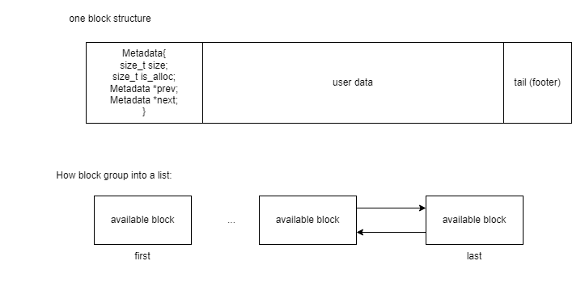
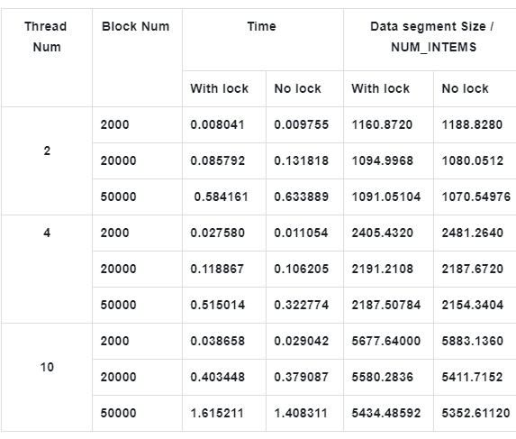

# Malloc_lab
My malloc lab based on C

## REPO STRUCTURE

```bash
│  README.md
│
├─plain_malloc    (dir for the code running only in one thread)
│      Makefile
│      my_malloc.c  (code based on structure Metadata)
│      my_malloc.h  
│      my_malloc_csapp.c (code based on CMU15213)
│      report.pdf
│
└─thread_malloc (dir for the code running in multiple thread)
        .gitignore
        libmymalloc.so
        Makefile
        my_malloc.c  (two kinds of implementation with different locking granularity)
        my_malloc.h
        my_malloc.o
```

Metadata structure:



## **Implement Detail and Optimization:**

One thread version: Maintain an explicit available block linklist

1. **Time Optimation**

   1. All the function time complexity is O(1) (Except for ff_malloc and bf_mallloc)
   2. In order to accelerate the execution time, I define macros to do tail-related work.
   3. I maintain an out-of-order free linkedlist. When inserting the block into the free list, I always insert the block in the header to save time, therefore the linklist related function `static void remove_block(Metadata * p)` and `static void add_block_to_head(Metadata *p)` function only costs O(1) time complexity.
   4. When coalesce the block with previous and next block, computing previous address base on the information in footer and next block information in Meatadata, rather than search all list to find previous or next block.
   5. When using the best-fit strategy, I set a threshold(DSIZE = 8 byte) . If the block with inner fragment size is smaller than threshold, I choose this block immediately and break the searching process.
   6. When reusing the old block, I set a threshold(DSIZE = 8 byte) . If the block with inner fragment size is smaller than threshold, I will not split the block into two block.

2. **Memory Optimation**

   1. In malloc data, when choosing a block much larger than the user needed size, split the block into two blocks and use the user needed size one.
   2. In free data, when freeing a block, check if the previous address block and next address block is also available . If it is, coalesce them together immediately.
   3. In order to reduce the usage of memory, I cancel the sentinels as dummy header and tail of the free list and maintain the existing header and tail block.

3. **The different between csapp version and Metadata version:**

   CSAPP version: 

   1. most of operation based on macros, saving time
   2. plug size and allocated status into one word size, saving more space

   backward: 

   1. Cannot feat in non-lock version for the lab2 homework at Duke, cause all the blocks are coalesce based on physical address. It is hard to maintain threads isolation when no lock outside malloc function. 
   2. Hard to debug (Well...

   Metadata version:

   1. Can adapt to lab2 multiple threads homework at Duke easier
   2. Easy to maintain and revise, therefore I wrote version two at multiple threads malloc lib.

   backward:

   1. unnecessary prev pointer, which waste space: actually I have wrote the Metadata with only one pointer version. But when I test two version in Duke’s test platform, I found binary linklist will get better performance. 
   2. Needed to maintain a actual available first and last block. I think it is better to  use sentinel therefore when update the linklist code will be more elegant.  But the reality is, I need to try my best to save the space in heap, and also when I use sentinel I found the speed of malloc and free drop down sharply. I will continue study on it during my holiday to figure out the reason. 

## Multi-threads version

### Structure:

```bash
* with lock: 
 *data structure of an available block:
 *                  free Metadata address
 *                          ^
 *                          | 
 *     | size | is_alloc | prev | next | **other data** | footer(tail) |  
 *                                  |        |
 *                                  |        v
 *                                  v       payload
 *                        free  Metadata address 
 * 
 *
 ****************************************************************
 *
 * without lock: (remove the footer)
 *data structure of an available block:
 *                  free Metadata address
 *                          ^
 *                          | 
 *     | size | is_alloc | prev | next | **other data** | 
 *                                  |        |
 *                                  |        v
 *                                  v       payload
 *                        free  Metadata address
```

**With lock:(Version 1)**

- Maintain an disorder linklist with firstNode pointer and last Node pointer
  - Insert: always insert into head and remove from current position, which cost time complexity O(1)
- Use a footer tag to detect if the previous physical address block is allocated and next block is allocated when freeing space.
- Critical Section:

1. All threads using the same linklist with the same firstNode and last node, when update their positions we need to take care
2. When coalesce blocks, I need to detect the current position of heap in order to not to get out of bound of heap(Segment Fault) when checking next block, and I also need to maintain a beginning to record beginning address of heap in order to not to get out of bound of heap when checking the previous block, so we need to take care of sbrk function.

- My currency method:

Put mutex outer the malloc and free function:

`void * ts_malloc_lock(size_t size) {
  pthread_mutex_lock(&lock);
  void * p = bf_malloc(size, No_sbk_lock, &first_free_lock, &last_free_lock);
  pthread_mutex_unlock(&lock);
  return p;
}
void ts_free_lock(void * ptr) {
  pthread_mutex_lock(&lock);
  bf_free(ptr, No_sbk_lock, &first_free_lock, &last_free_lock);
  pthread_mutex_unlock(&lock);
}`

**Without lock:(Version 2)**

- Maintain an orderly linklist with firstNode pointer and last Node pointer
  - Insert: traverse the linklist to find its right position to insert which cost time complexity O(n), n is the length of linklist
- When coalesce blocks, because the blocks' address is in order, we can simply compare the previous available block and next available block with their physical addresses.
- Critical Section:

1. All threads using the same linklist with the same firstNode and last node, when update their positions we need to take care
2. sbrk function is not thread safe, so it will maintain a wrong heap address

- My currency method:

1. Every thread own their linklist with __thread
2. Mutex lock when using sbrk

## Performance Result

****Result****



****Comparasion:****

1. When thread num is small(such as 2):

The non-lock version and lock version have similar speed performance when allocating different number of block items and space usages.

1. When thread num is large:

Then lock version always costs more excution time than non-lock version, because we lock all the process of malloc and free block.

For space usage, I found when the needed block items number is small, such as 2000, the lock version will cost more space than the non-lock version. When block items number are large, such as 20000 and 50000, the non-lock version will cost more space than lock-version.

I think it is because all threads use the same linklist and merge the same physical consecutive blocks. When needed block number is small, it is easier to get inner fragments. But when the needed block number is large, from each threads' view, they only use their own available linklist, which will waste a lot of space when it cannot find an available block but heap actually has the available blocks owned by other threads.

